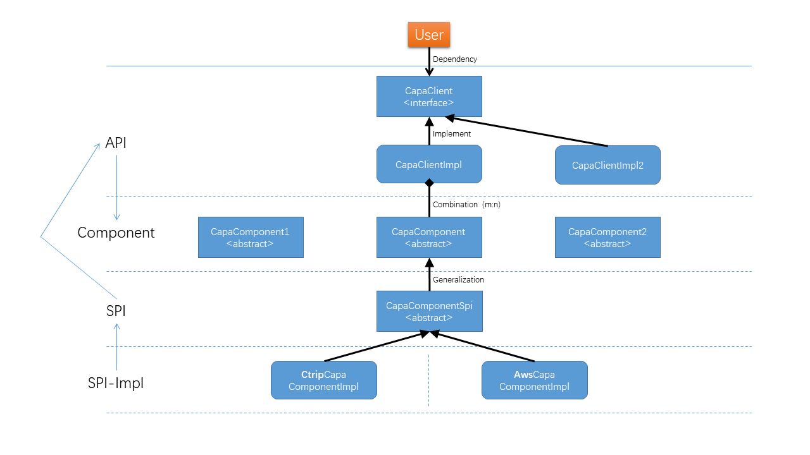

# Capa(cloud application api): To be the high-level api layer for all application runtime.

Define a common set of APIs to make sure that code once and run anywhere!

This is the Capa SDK for Java, including the following features:

+ Service Invocation(RPC)
+ Configuration Centor(Configuration)
+ Publish/Subscribe(Pub/Sub)
+ State Management(State)
+ Application Metrics(Metrics)
+ 
参考项目:

* [dapr](https://github.com/dapr/dapr)
* [layotto](https://github.com/mosn/layotto)

## Introduction

使用与具体实现无关的统一的编程API，所以应用程序在编程时不需要依赖任何具体的基础设施和中间件，只需要依赖CAPA的抽象层SDK即可。

在部署到不同的环境时，装载抽象SDK的不同实现到应用程序中，当调用统一的编程API时，底层适配到不同的具体实现。

所以应用程序不管将来要运行在哪里，只需要依赖一套统一的SDK就可以了。

**参考资料：** https://github.com/dapr/dapr/issues/3261

### Why not DAPR

设计思想和Dapr等项目是相同的，但是Dapr等项目走的非常靠前，其逻辑依赖于独立部署的dapr-sidecar来实现。

这就要求从最底层的基础设施层进行支持，但很多时候，我们并不能一步到位的切换到sidecar的模式。

故Capa将sidecar中的逻辑移植到SDK中，应用无需依赖sidecar，引入SDK即可。

未来肯定是要发展向Dapr这种模式，但是在过渡期，Capa这种模式将一直存在。

**参考资料：** https://github.com/dapr/dapr/issues/2817

## API Design

API设计和社区保持同步，请参考Dapr/Layotto等开源项目的设计。

目前API定义在: [cloud-runtimes](https://github.com/reactivegroup/cloud-runtimes-jvm) 中

#### SDK层次设计

module划分主要为以下几个部分：
* sdk
* sdk-component
* sdk-spi
* sdk-spi-demo/...



应用程序编程时只需要依赖sdk即可，并使用SDK模块中定义的统一编程API。

在运行前，会将具体的SPI实现包引入进去，作为统一编程API的具体实现。

#### 举例：[RPC API design]()

## Getting Started

#### Importing Capa's Java SDK

For a Maven project, add the following to your pom.xml file:

```xml
<project>
  ...
  <dependencies>
    ...
     <!-- Capa's core SDK with all features. -->
    <dependency>
      <groupId>group.rxcloud</groupId>
      <artifactId>capa-sdk</artifactId>
      <version>1.0.2.RELEASE</version>
    </dependency>
    ...
  </dependencies>
  ...
</project>
```

Sample implementation library:

```xml
<project>
  ...
  <dependencies>
    ...
     <!-- Capa's core SDK with all features. -->
    <dependency>
      <groupId>group.rxcloud</groupId>
      <artifactId>capa-sdk-spi-demo</artifactId>
      <version>1.0.2.RELEASE</version>
    </dependency>
    ...
  </dependencies>
  ...
</project>
```

#### Running the examples

Try the following examples to learn more about Capa's Java SDK:

* [capa-demo](https://github.com/reactivegroup/capa/tree/master/sdk-spi-demo)
* [capa-aws](https://github.com/reactivegroup/capa-aws)
* [capa-alibaba](https://github.com/reactivegroup/capa-alibaba)

#### Reactor API

The Java SDK for Capa is built using [Project Reactor](https://projectreactor.io/). It provides an asynchronous API for Java. When consuming a result is consumed synchronously, as in the examples referenced above, the `block()` method is used.

The code below does not make any API call, it simply returns the [Mono](https://projectreactor.io/docs/core/release/api/reactor/core/publisher/Mono.html) publisher object. Nothing happens until the application subscribes or blocks on the result:

```java
Mono<String> result = capaRpcClient.invokeMethod(SERVICE_APP_ID, "say", "hello", HttpExtension.POST, null, TypeRef.STRING);
```

To start execution and receive the result object synchronously, use `block()`. The code below shows how to execute the call and consume an empty response:

```java
Mono<String> result = capaRpcClient.invokeMethod(SERVICE_APP_ID, "say", "hello", HttpExtension.POST, null, TypeRef.STRING);
String response = result.block();
```

#### Exception handling

Most exceptions thrown from the SDK are instances of `CapaException`. `CapaException` extends from `RuntimeException`, making it compatible with Project Reactor.